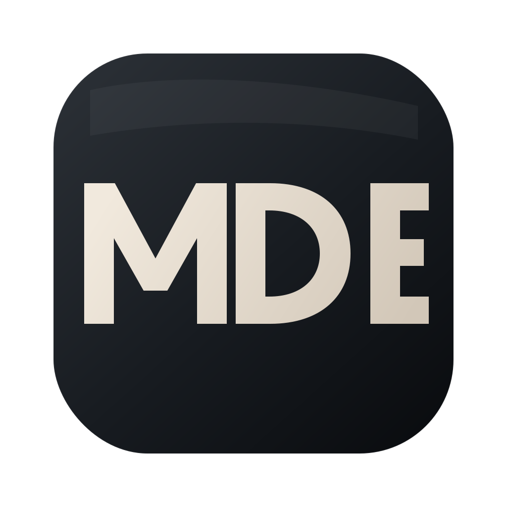

# MD Editor

Nativní Markdown editor pro macOS, postavený na [Tauri](https://tauri.app) (Rust + vanilla JS).



## Instalace (pro uživatele)

**Požadavky:** macOS 11+ na Apple Silicon (M1/M2/M3/M4). Intel Mac zatím není podporován.

1. Stáhni si nejnovější `.dmg` z [Releases](../../releases/latest).
2. Otevři `.dmg` a přetáhni **MD Editor** do složky *Applications*.
3. **Odblokuj appku** — tohle je potřeba vždycky při prvním stažení, jinak macOS ukáže hlášku `„MD Editor" je poškozena a nelze ji otevřít` (appka není rozbitá, je to jen Gatekeeper, protože není notarizovaná u Apple). V Terminálu spusť:

   ```bash
   xattr -cr "/Applications/MD Editor.app"
   ```

   Potom už spouštěj appku normálně — z Applications, Launchpadu, nebo Spotlightu.

> Obcházka „klik pravým → Open" na novějších macOS (Sonoma/Sequoia) obvykle nefunguje a rovnou hodí hlášku o poškození. Používej terminálový příkaz výše.

Po odblokování už se appka otevírá normálně. Při každém novém releasu je třeba příkaz spustit znovu (nová `.app` = nová karanténa).

## Funkce

- Live preview vedle editoru
- Toolbar pro základní Markdown (H1–H3, bold, italic, code, link, list, quote, table, hr)
- Taby pro víc otevřených souborů
- Find bar (⌘F) se zvýrazněním všech nálezů v editoru i v preview
- Asociace s `.md` / `.markdown` soubory
- Zkratky: ⌘O otevřít, ⌘S uložit, ⌘W zavřít tab, ⌘B bold, ⌘I italic, ⌘K link

## Sestavení ze zdrojáků

**Požadavky:**
- [Rust](https://www.rust-lang.org/tools/install) (stabilní)
- [Node.js](https://nodejs.org) 20+
- Xcode Command Line Tools: `xcode-select --install`

```bash
git clone https://github.com/xjava0sky1/cc-md-editor.git
cd cc-md-editor
npm install
npm run build
```

Výsledný `.dmg` najdeš v `src-tauri/target/release/bundle/dmg/`.

Pro vývoj: `npm run dev` (spustí appku s hot-reloadem frontendu).

## Vydání nové verze (pro maintainera)

Release je plně automatizovaný přes GitHub Actions. Stačí jeden příkaz:

```bash
./scripts/release.sh 0.2.0
```

Skript zvýší verzi v `package.json` i `src-tauri/tauri.conf.json`, commitne, vytvoří tag `v0.2.0` a pushne ho. GitHub Actions pak ~5–10 minut staví `.dmg` na macOS runneru a vytvoří Release s přiloženým buildem. Sleduj průběh v záložce [Actions](../../actions).

Podmínky:
- Pracovní adresář musí být čistý (žádné necommitované změny).
- Verze ve formátu `X.Y.Z` (např. `0.2.0`, `1.0.0`).
- `gh` CLI přihlášené (`gh auth status`).

## Licence

Private project.
